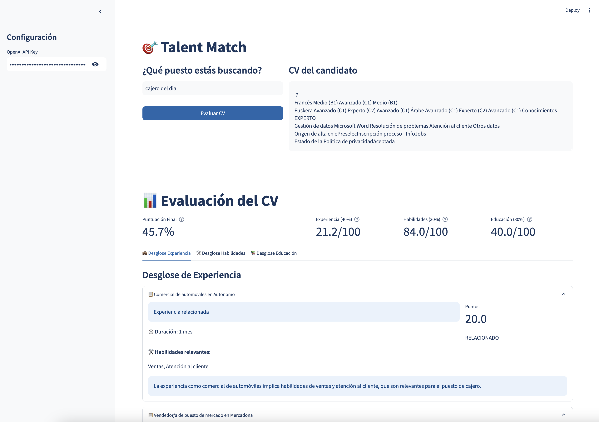
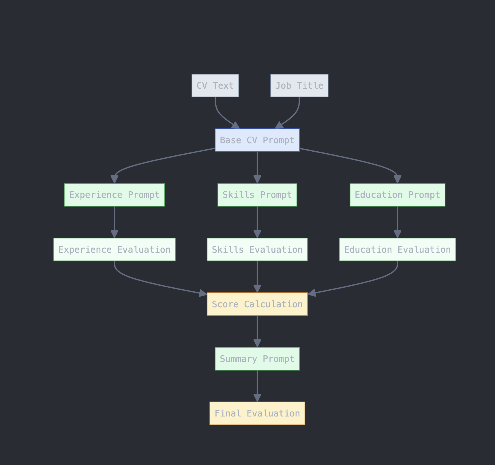

# Talent Match

AI-powered CV evaluation tool that analyzes resumes against job requirements using OpenAI's GPT models.



## Features

- Experience evaluation with relevance scoring
- Skills assessment with proficiency levels
- Education analysis
- Overall fit calculation
- Detailed feedback and recommendations

## Prompt Diagram



## Requirements

- Python 3.11+
- OpenAI API key
- Poetry for dependency management

## Installation

1. Clone the repository:

```bash
git clone https://github.com/yourusername/talent-match.git
cd talent-match
```

2. Install dependencies using Poetry:

```bash
poetry install
```

## Configuration

1. Create a `.env` file in the project root with the following variables:

```env
OPENAI_API_KEY=your_api_key_here
```

2. Customize settings (optional):
   The application's behavior can be configured by modifying `src/talent_match/config/settings.py`. Here are the main configuration options:

```python
# Evaluation Weights - Define how much each aspect contributes to the final score
EXPERIENCE_WEIGHT = 0.4    # 40% of final score comes from experience
SKILLS_WEIGHT = 0.3       # 30% of final score comes from skills
EDUCATION_WEIGHT = 0.3    # 30% of final score comes from education

# Experience Config
MAX_YEARS_FULL_SCORE = 5  # Number of years needed to achieve maximum experience score
DIRECT_SCORE = 100.0      # Base points awarded for direct experience in the same role
RELATED_SCORE = 20.0      # Base points awarded for related but not direct experience
RECENCY_BONUS = 0.2       # Additional 20% score bonus for recent experience
RECENCY_YEARS = 2         # Experience within this many years is considered recent
DIRECT_EXPERIENCE_WEIGHT = 0.7    # How much direct experience contributes to experience score
RELATED_EXPERIENCE_WEIGHT = 0.3   # How much related experience contributes to experience score

# Skills Config
MIN_SKILLS = 5                     # Minimum number of skills needed for full score
SKILL_BASIC_SCORE = 33.3          # Points awarded for basic level in a skill
SKILL_INTERMEDIATE_SCORE = 66.6    # Points awarded for intermediate level in a skill
SKILL_ADVANCED_SCORE = 100.0      # Points awarded for advanced level in a skill

# Relevance Multipliers (0-100) - Used to weight skills based on their importance
RELEVANCE_NONE = 0.0        # Skill has no relevance to the position
RELEVANCE_VERY_LOW = 20.0   # Skill has very minimal relevance to the position
RELEVANCE_LOW = 40.0        # Skill has some minor relevance to the position
RELEVANCE_MEDIUM = 60.0     # Skill is moderately relevant to the position
RELEVANCE_HIGH = 80.0       # Skill is highly relevant to the position
RELEVANCE_VERY_HIGH = 100.0 # Skill is crucial for the position

# Education Scores - Points awarded based on education relevance
EDUCATION_NONE = 0.0        # Education has no relevance to the position
EDUCATION_VERY_LOW = 20.0   # Education has very minimal relevance to the position
EDUCATION_LOW = 40.0        # Education has some minor relevance to the position
EDUCATION_MEDIUM = 60.0     # Education is moderately relevant to the position
EDUCATION_HIGH = 80.0       # Education is highly relevant to the position
EDUCATION_VERY_HIGH = 100.0 # Education is perfectly aligned with the position
```

## Usage

1. Start the application:

```bash
poetry run python run.py
```

2. Open your browser and navigate to http://localhost:8501

3. Enter the job title and paste the CV content

4. Click "Evaluate CV" to get the analysis
